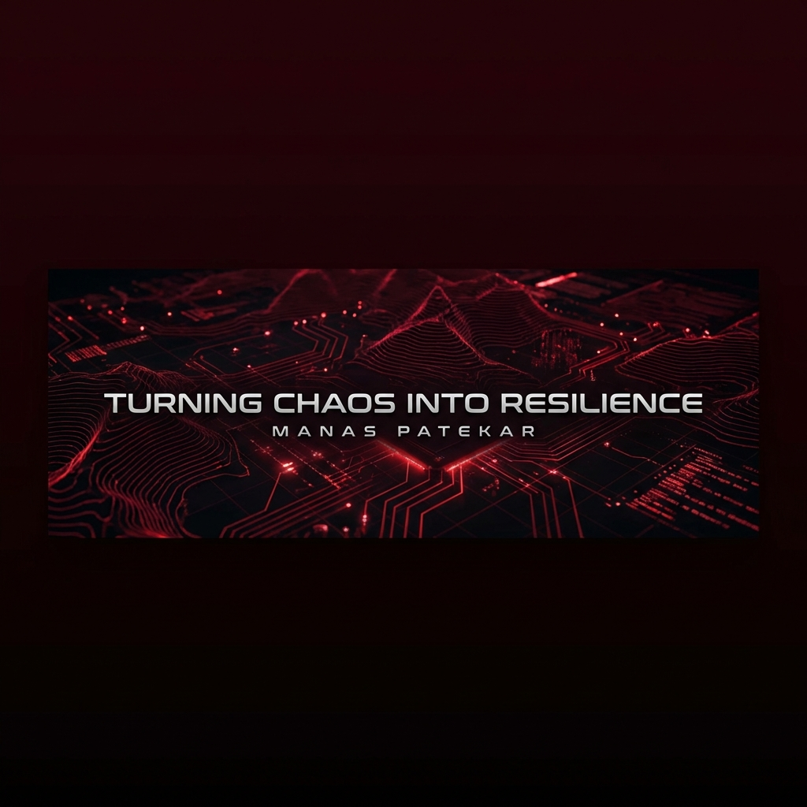

  

  <h1 align="center">👨‍💻 Hi there, I'm <a href="https://github.com/ManasPatekar">Manas</a>!</h1>
  <h3 align="center">🚀 Turning Caffeine into Code & Exploits</h3>

  

  <b><i>"In a world of fragile codes and shifting trust, a true hacker involves not just breaking, but building resilience from the chaos."</i></b>

 

---

### 🛠️ Arsenals & Tech Stack

  

 

  
  
  

---

### 📊 Github Analytics

  <!-- Top Stats -->
  

 

  <!-- Commits & Languages -->
  
  

---

### 🏆 Languages & Contributions

<!-- Replaced broken Trophies with reliable Top Languages Chart -->

   
   

   
  

---

  

