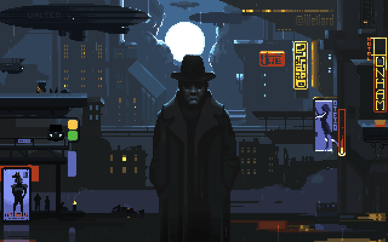

<div align="center">
  
</div>

<div align="center">
  
</div>

<div align="center">
  <h1 align="center">step into the <a href="https://github.com/ManasPatekar">Macros</a> matrix 💊🐇</h1>
  <h3 align="center">cybersecurity menace 😈 | turning caffeine into exploits and late-night regrets ☕💀</h3>
</div>

<p align="center">
  <a href="https://git.io/typing-svg">
    
  </a>
</p>

<div align="center">
  <b><i>"I write code that looks like magic, and exploits that look like accidents. 🪄💥"</i></b>
</div>
<br>

<div align="center">
  <a href="https://www.linkedin.com/in/manas-patekar-b586932b0/">
    
  </a>
  <a href="https://www.youtube.com/channel/UCmXpWR4u32RZif49soiXdOQ">
    
  </a>
  <a href="mailto:your-email@example.com">
    
  </a>
</div>

---

### 🧑‍🍳 let him cook (W tech stack) 💯

<div align="center">
  
</div>
<br>
<div align="center">
  
  
  
</div>

---

### 💻 whoami (the lore)

```python
class Macros(Hacker, FullStackDev):
    def __init__(self):
        super().__init__()
        self.roles = ["Cybersecurity Researcher 🕵️‍♂️", "Freelance Web & App Dev 💻"]
        self.current_hyperfixation = "Building scalable apps & breaking them"
        self.caffeine_level = 9000
        self.sleep_schedule = "404 Not Found"
        self.tabs_open = float('inf')
        
    def daily_routine(self):
        while True:
            self.drink_monster_energy()
            self.code_full_stack_apps()
            self.hunt_bugs()
            if self.client_is_happy() and self.found_exploit():
                self.celebrate_with_more_caffeine()
            else:
                self.blame_dns()
```

---

### 🔮 main character lore & aura stats

<div align="center">
  <p><b>Current Vibe:</b> chaotic good 😈 | <b>Status:</b> cooking up exploits 🍳</p>
  
  <table>
    <tr>
      <th>Stat</th>
      <th>Power Level</th>
      <th>Lore Details</th>
    </tr>
    <tr>
      <td><b>Caffeine Intake</b></td>
      <td>██████████ 100%</td>
      <td><i>Running purely on Monster Energy & spite</i> 🔋</td>
    </tr>
    <tr>
      <td><b>Terminal Rizz</b></td>
      <td>████████▓░ 90%</td>
      <td><i>Making the bash shell look aesthetic</i> 💻</td>
    </tr>
    <tr>
      <td><b>Full-Stack Aura</b></td>
      <td>██████████ 100%</td>
      <td><i>Can build the app AND hack it</i> 🌐</td>
    </tr>
    <tr>
      <td><b>Freelance Hustle</b></td>
      <td>█████████░ 95%</td>
      <td><i>Shipping projects and getting that bag</i> 💰</td>
    </tr>
    <tr>
      <td><b>Touching Grass</b></td>
      <td>█░░░░░░░░░ 10%</td>
      <td><i>What is outside? Is that a new JS framework?</i> 🌿</td>
    </tr>
    <tr>
      <td><b>Bug Bounty Aura</b></td>
      <td>██████████ 100%</td>
      <td><i>The ops (bugs) stand no chance fr</i> 🕷️</td>
    </tr>
  </table>

  <br>
  
  

  <br><br>

  
  
  
</div>

---

<div align="center">
  
</div>
<div align="center">
  
</div>
